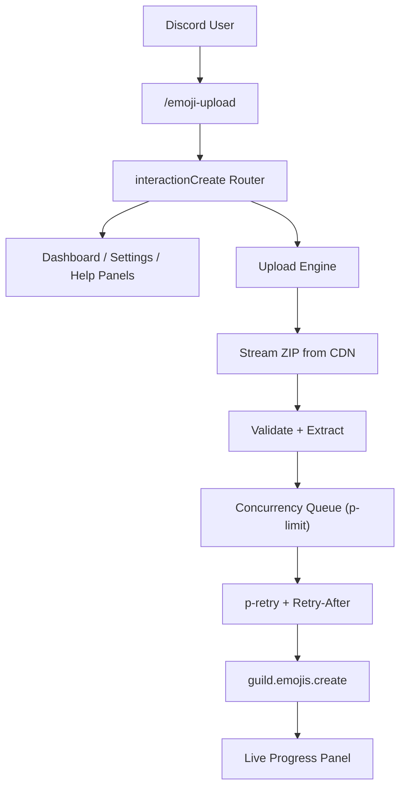

# Emoji Wizard

<div align="center">

**Production-grade Discord emoji mass-uploader with a Components V2 slash-command control plane.**


`/emoji-upload`

</div>

---

## Overview

Emoji Wizard is a Discord bot that turns a folder of emoji images into live server emojis with a single command. Drop a `.zip` of images into the slash command (or upload it after), and the bot validates, extracts, and uploads them through a live progress dashboard — fitting the upload to your server's available emoji slots.

| Layer | Purpose |
|---|---|
| **Slash Controller** | A Discord bot that exposes `/emoji-upload`, Components V2 panels, settings modals, and confirmations. |
| **Upload Engine** | Streams the ZIP from Discord's CDN, validates/extracts it, and runs a concurrency-limited upload queue. |
| **Emoji Pipeline** | Per-file validation, name normalisation, de-duplication, and Discord rate-limit aware retries. |

The current release is a single-process bot. The architecture is already split into builders, handlers, and an upload engine so future features (multi-server, scheduled syncs) slot in cleanly.

---

## Highlights

- **One command, zero friction:** `/emoji-upload` with the ZIP attached starts the upload immediately; without it, a dashboard opens so you can upload after.
- **Components V2 UI:** Dashboard, live progress, completion, settings, and error panels all render with containers, separators, buttons, and modals.
- **Streaming, not memory-hungry:** The ZIP is downloaded and extracted with Node streams, so huge archives never load fully into RAM.
- **Fit-to-slots uploading:** When the server is near capacity, Emoji Wizard uploads what fits and skips the overflow instead of aborting the whole batch.
- **Resumable-safe queue:** `p-limit` concurrency + `p-retry` with Discord `Retry-After` handling keeps uploads fast without tripping rate limits.
- **Settings that stick:** Concurrency, retries, progress interval, and behaviour flags are configurable per session via a modal or the settings panel.
- **Dry-run mode:** Simulate the full pipeline (validate → extract → queue) without creating a single emoji.
- **Defensive validation:** ZIP-slip protection, size/type checks, and per-file validation happen before any upload begins.

---

## Command Center Preview

```text
/emoji-upload

🤖 Emoji ZIP Uploader
My Server • Level 0

🟢 Ready — No active upload

### 📦 Emoji Slots
📦 Static   🟢 ████████░░ 12/50 (38 free)
🎞️ Animated 🟢 ████████░░ 8/50 (42 free)

[Upload ZIP] [Settings] [Advanced] [Help]
```

```text
/emoji-upload  (with attached zip)

## 📤 Uploading Emojis
**PokeUnited.zip** • 65 emojis

████████████░░ 82%  (54/65)
✅ Done 54   ❌ Failed 0   ⚪ Skipped 0   ⬜ Pending 11   🔵 Uploading 2 / 2

[Abort]
```

```text
Advanced (settings modal)

⚙️ Upload Settings
Concurrency (1–10):        2
Max Retries (0–10):        3
Progress Interval (ms):    2000
Flags:                     auto_rename animated_first
```

---

## Architecture



### Current Mode

```text
Discord Slash Command -> Upload Engine -> guild.emojis.create
```

All panels are public (Components V2) and edited in place as the upload progresses.

---

## Project Structure

```text
emoji-wizard/
├── src/
│   ├── index.ts                 # Bot entrypoint (login + graceful shutdown)
│   ├── bot.ts                   # Discord client factory + event registration
│   ├── commands/
│   │   ├── index.ts             # Slash command registry
│   │   └── emoji-upload.ts      # /emoji-upload entrypoint
│   ├── builders/                # Components V2 panel builders
│   │   ├── dashboard.ts
│   │   ├── progress.ts
│   │   ├── completion.ts
│   │   ├── settings.ts
│   │   ├── error-panel.ts
│   │   └── help.ts
│   ├── components/              # Buttons, modals, select menus
│   │   ├── buttons.ts
│   │   ├── modals.ts
│   │   └── selects.ts
│   ├── handlers/                # Interaction routers
│   │   ├── button.ts
│   │   ├── select.ts
│   │   └── modal.ts
│   ├── upload/                  # Pipeline orchestration
│   │   ├── engine.ts            # Download + validate + queue driver
│   │   └── session.ts          # Stage validation/extraction + slot capping
│   ├── emoji/                   # Per-file logic
│   │   ├── validator.ts
│   │   ├── processor.ts
│   │   └── uploader.ts
│   ├── zip/                     # Archive handling
│   │   ├── validator.ts
│   │   └── extractor.ts
│   ├── queue/                   # Concurrency manager
│   │   └── manager.ts
│   ├── storage/                 # Session store
│   │   └── session-store.ts
│   ├── config/                  # Runtime config + schema
│   │   ├── index.ts
│   │   └── schema.ts
│   ├── constants/               # Limits, icons, custom IDs
│   │   └── index.ts
│   ├── logging/                 # Winston logger
│   │   └── logger.ts
│   ├── utils/                   # Discord + formatting helpers
│   │   ├── discord.ts
│   │   ├── format.ts
│   │   └── progress.ts
│   ├── events/                  # Discord event handlers
│   │   ├── ready.ts
│   │   ├── interactionCreate.ts
│   │   └── error.ts
│   └── types/                   # Shared types/errors
│       └── index.ts
├── scripts/
│   └── deploy-commands.ts       # Slash command registration
├── .env.example
├── package.json
├── tsconfig.json
└── README.md
```

---

## Setup

### 1. Install

```bash
pnpm install
```

### 2. Configure

Copy the example env and fill in your bot credentials:

```bash
cp .env.example .env
```

Edit `.env`:

```env
DISCORD_TOKEN=YOUR_BOT_TOKEN
DISCORD_CLIENT_ID=YOUR_APPLICATION_ID
# Optional: register commands to one guild for instant testing
DISCORD_GUILD_ID=
```

### 3. Deploy Slash Commands

Register the command globally (can take up to 1 hour to propagate) or to a single guild for instant testing:

```bash
pnpm run deploy:global      # Global registration
pnpm run deploy             # Guild-scoped (needs DISCORD_GUILD_ID)
```

### 4. Start

```bash
pnpm start                  # Run once
pnpm dev                    # Auto-restart on file changes (tsx watch)
```

On startup:

- The bot logs in and prints the online banner.
- `/emoji-upload` is available wherever the bot is present.
- The bot needs the **Manage Expressions** permission in the target server.

---

## Configuration

### `.env`

| Key | Type | Description |
|---|---|---|
| `DISCORD_TOKEN` | string | Bot token from the Discord Developer Portal. |
| `DISCORD_CLIENT_ID` | string | Application ID for slash-command registration. |
| `DISCORD_GUILD_ID` | string | Optional guild for fast command registration. Leave blank for global. |
| `MAX_ZIP_SIZE_MB` | number | Maximum uploaded ZIP size. Default: `100`. |
| `TEMP_DIR` | string | Temp directory for ZIP extraction. Default: `./tmp`. |
| `LOG_LEVEL` | string | `error` \| `warn` \| `info` \| `debug` \| `silly`. Default: `info`. |
| `LOG_DIR` | string | Directory for rotating logs. Default: `./logs`. |
| `DEFAULT_CONCURRENCY` | number | Parallel upload concurrency (1–10). Default: `2`. |
| `DEFAULT_MAX_RETRIES` | number | Retry attempts per emoji (0–10). Default: `3`. |
| `PROGRESS_INTERVAL_MS` | number | Live progress update interval. Default: `2000`. |
| `NODE_ENV` | string | `development` or `production`. |

---

## Slash Commands

### Primary

| Command | Description |
|---|---|
| `/emoji-upload [zip] [dry_run]` | Open the dashboard, or start an upload immediately when a ZIP is attached. |

### Dashboard Actions

| Action | Description |
|---|---|
| **Upload ZIP** | Prompts you to send a ZIP in the channel, then begins the upload. |
| **Settings** | Open the settings panel (concurrency, retries, flags). |
| **Advanced** | Open the settings modal for precise tuning. |
| **Help** | Open the help panel. |
| **Refresh** | Reload the dashboard. |
| **Cancel** | Cancel and clean up the active session. |
| **Abort** | Stop an in-progress upload. |

### Settings

| Field | Description |
|---|---|
| `Concurrency` | Parallel uploads (1–10). |
| `Max Retries` | Retry attempts per emoji (0–10). |
| `Progress Interval` | How often the live panel updates (ms). |
| `Flags` | `auto_rename`, `skip_dup`, `animated_first`, `dry_run`, `lenient`. |

---

## Supported Formats & Limits

Emoji Wizard validates against Discord's real constraints before uploading.

| Limit | Value |
|---|---|
| File types | `.png` `.gif` `.jpg` `.jpeg` `.webp` |
| Max file size | 256 KB per emoji |
| Max dimensions | 128 × 128 pixels |
| Name length | 2–32 characters |
| Name characters | `a–z`, `0–9`, underscore only |
| Emoji slots | 50 static / 50 animated (Level 0) |
| ZIP size | 100 MB default (configurable) |

Server boost increases slots (Level 1: 100, Level 2: 150, Level 3: 250). When a server is near capacity, Emoji Wizard uploads what fits and skips the rest.

---

## Production Safety

- All uploads require the **Manage Expressions** permission.
- ZIP validation, extraction, and per-file checks run before any emoji is created.
- ZIP-slip paths and non-image files are rejected during extraction.
- Uploads are capped to available server slots; overflow is skipped, never force-written.
- Logs and temp files live outside the repo (see `.gitignore`); `.env` is never committed.
- The bot uses Discord's `Retry-After` header to back off on rate limits.

Important files to keep private:

```text
.env
logs/
tmp/
```

---

## Operations Checklist

- [ ] `DISCORD_TOKEN` and `DISCORD_CLIENT_ID` are set in `.env`.
- [ ] The bot has **Manage Expressions** in the target server.
- [ ] Slash commands are deployed (`pnpm run deploy` or `deploy:global`).
- [ ] `MAX_ZIP_SIZE_MB` matches your expected archive sizes.
- [ ] `.env` is present in `.gitignore`.
- [ ] `logs/` and `tmp/` are ignored by git.
- [ ] No tokens are present in README, logs, screenshots, or commits.

---

## Development

### Start

```bash
pnpm dev        # tsx watch
```

### Typecheck

```bash
pnpm run typecheck
```

### Register commands manually

```bash
pnpm run deploy             # guild-scoped
pnpm run deploy:global      # global
```

---

## Disclaimer

This project is for legitimate server administration and emoji management. You are responsible for how you run, host, and secure this software, and for complying with Discord's Terms of Service and the permissions you grant the bot.

---

<div align="center">

**Emoji Wizard: one ZIP in, a full emoji shelf out.**

</div>
